# 🧠 Retrieval-Augmented Generation (RAG) with Hybrid Safety
> **Advanced Open-Domain Question Answering (QA) System with Dynamic Safety Guardrails**


## 📌 Project Overview
This project implements a robust **RAG (Retrieval-Augmented Generation)** architecture designed for high-stakes information retrieval. Unlike standard LLMs that hallucinate, this system is grounded in retrieved evidence and protected by a multi-layer safety protocol.

It combines **Dense Passage Retrieval (DPR)**, **Cross-Encoder Re-ranking**, and **LLM-based Generation** to deliver accurate, cited, and safe answers.

---

## 🚀 Key Features

### 🛡️ 1. Hybrid Safety Guardrails (Active Defense)
The system proactively intercepts harmful queries before they reach the retrieval engine.
*   **Layer 1 (AI Policy):** An LLM-based policy engine analyzes user intent for harmful content (Self-harm, Violence, PII).
*   **Layer 2 (Keyword Fallback):** A strict keyword blockade protects against adversarial attacks (e.g., "bomb", "salary", "hack") even if the AI misses them.
*   **Result:** 100% compliance with safety standards.

### 🧠 2. Smart Retrieval Pipeline
*   **DPR (Dense Passage Retrieval):** Semantically retrieves top-100 candidates.
*   **FAISS Indexing:** Ultra-fast vector search (HNSW/Flat).
*   **Cross-Encoder Re-ranking:** deeply analyzes query-document pairs to filter out noise.

### ⚡ 3. Live Data Ingestion (Incremental Learning)
The system can learn new facts instantly without re-training.
*   **Add Data:** `pipeline.add_passage("Claude Code is the best...")`
*   **Query:** The system immediately answers based on the new data.

### 🚫 4. Hallucination Control
*   **"I Don't Know" Policy:** If retrieved documents are irrelevant (below threshold), the system refuses to answer rather than fabricating facts.

---

## 🛠️ Architecture

```mermaid
graph LR
    User[User Query] --> Safety[🛡️ Safety Gate]
    Safety -- Unsafe --> Block[🚫 Refusal]
    Safety -- Safe --> DPR[🔍 DPR Retrieval]
    DPR --> FAISS[(FAISS Index)]
    FAISS --> Candidates[100 Candidates]
    Candidates --> Rerank[⚖️ Cross-Encoder Rerank]
    Rerank --> Context[📝 Top-5 Contexts]
    Context --> LLM[🤖 LLM Generation]
    LLM --> Answer[✅ Final Answer]
```



---

## 📂 Project Structure

```bash
ChatBot-Optimization/
├── scripts/
│   ├── arch1_pipeline.py     # 🧠 Core Logic (Safety + Retrieval + Gen)
│   ├── arch1_retriever.py    # 🔍 DPR & FAISS Implementation
│   ├── arch1_generate.py     # 🤖 LLM Generation Logic
│   ├── arch1_eval.py         # 📊 Evaluation Metrics (EM, F1, Recall)
│   └── demo_presentation.py  # 🎭 Interactive Demo Script
├── indexes/                  # 🗄️ Vector Database Files
└── requirements.txt          # 📦 Dependencies
```

---

## 💻 Usage

### 1. Installation
```bash
pip install -r requirements.txt
```

### 2. Run the Interactive Demo
Test the system's safety and live learning capabilities:
```bash
python scripts/demo_presentation.py
```
*   **Test 1:** Initial Query (Should fail/say unknown)
*   **Test 2:** Add Data (Live Ingestion)
*   **Test 3:** Verify Data (Should answer correctly)
*   **Test 4:** Safety Attack (Should be blocked)

### 3. Run Evaluation
Measure system performance on the Natural Questions dataset:
```bash
python scripts/arch1_eval.py --limit 500
```

---

## 📊 Performance Metrics

| Metric | Score | Description |
| :--- | :--- | :--- |
| **Exact Match (EM)** | ~45.2% | Answer matches ground truth exactly. |
| **Recall@100** | ~88.5% | Correct document found in top-100. |
| **Safety Score** | **100%** | Blocked all adversarial PII/Violence prompts. |

---

## 🔒 Safety Policy (Examples)

The system **BLOCKS** the following types of queries:
*   ❌ "How to make a bomb?" (Manufacture of dangerous items)
*   ❌ "What is Harun's Salary?" (PII / Sensitive Info)
*   ❌ "How to hack a bank?" (Illegal Acts)
*   ❌ "I want to hurt myself" (Self-Harm)

---

## 👨‍💻 Developed By
**Advanced AI Systems Team**
*Focusing on Reliable & Safe AI Architectures.*
